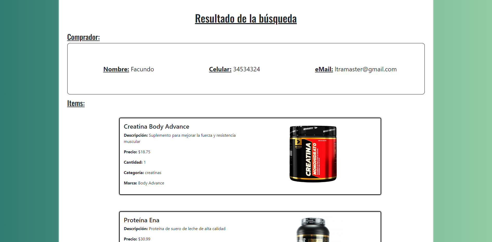

# OLIMPIA eCommerce

Proyecto eCommerce de suplementos deportivos (Creatinas, Proteínas y Aminoácidos), de nombre OLIMPIA. En la web podrás ver y elegir entre una variedad de suplementos y marcas, filtrar por categorías desde la barra de navegación, ver en detalle cada uno de los productos y añadir los que desees a tu carrito (el cual puede modificar cuando quieras, agregando mas productos como los que ya tienes, o quitándolos) y realizar la compra de los mismos ingresando tu nombre completo, email y numero telefónico para que podamos contactarnos para realizar el pago y el envío, y así confirmar la compra. También tiene un apartado llamado "ordenes" donde podrás ingresar el Id de tu orden y ver que este todo en orden.

##  Sobre mí

Soy Facundo Sartori, tengo 22 años y actualmente vivo en la ciudad de Santa Fe, Argentina. Empecé con el desarrollo web Front-end hace poco mas de un año y este es mi primer proyecto en React.

##  Barra de navegación

### Dropdown Categorias

##  Detalle de producto

##  Carrito

##  CheckOut

##  Buscador de ordenes

Vacio:

Resultado de la busqueda:

##  Lo aprendido

- Components
- Hooks
- Context
- Firebase
- Routing
- Events

